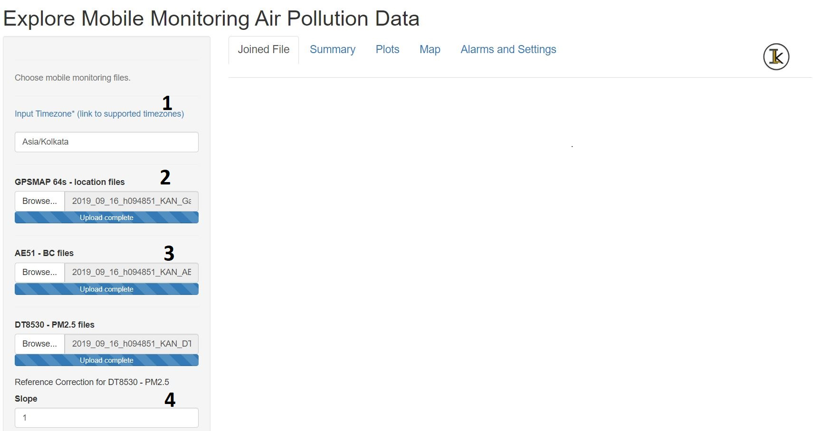
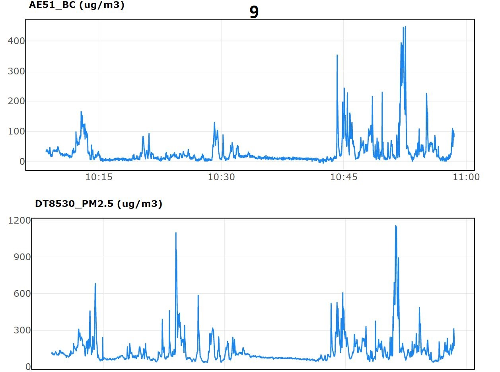

# mmaqshiny v1.0: R-Shiny package to explore air-pollution mobile monitoring data 

## Summary

Mobile monitoring of air quality is being gradually adapted by research groups and governments to complement their existing stationary monitoring facilities, to understand the hyper-local nature of the air quality levels.

The R-Shiny package `mmaqshiny` is for analysing, visualising and spatial-mapping of high-resolution air quality data collected by specific devices installed on a moving platform. 


High frequency `1-Hz` data of PM2.5 (mass concentrations of particulate matter with size less than 2.5 microns), Black carbon mass concentrations (BC), ultra-fine particle number concentrations, carbon-di-oxide along with GPS coordinates and relative humidity (RH) data are collected by some popular portable instruments (`TSI DustTrak-8530, Aethlabs microAeth-AE51, TSI CPC3007, LICOR Li-850, Garmin GPSMAP 64s, Omega USB RH probe` respectively) can be handled by this package. The package incorporates device-specific cleaning and correction algorithms. RH correction is applied to DustTrak PM2.5 following a method described in @Chakrabarti:2004. If required, user can also input linear regression coefficients for correcting the PM2.5 data. The package cleans BC data for the vibration generated noise, by adopting a statistical procedure as explained in @Apte:2011, followed by a loading correction as suggested by @Ban-Weiss:2009. For the ultra-fine particle number concentration data, provision is given for dilution correction factor (if a diluter is used with CPC3007; default value is 1). 


The package joins the raw, cleaned and corrected data from the above mentioned instruments and generates a downloadable csv file. It accepts multiple files for each parameter. The input files should have a date prefix of the format `yyyy_mm_dd` in their file names. The package can process multiple files from a given date at a time and the file name prefix is used to perform the check. If user inputs files with different file name prefix, then an error message will be generated. 


The package requires GPS file (.gpx) as a mandatory input along with timezone (a link to all accepted timezone formats in R is also included). All other pollutant files are optional.  


The output is displayed in five different tabs.

1) `Joined File` displays all cleaned and joined data 
2) `Summary` displays summary statistics for each parameter,
3)  `Plots` displays interactive  time series line plots for all parameters. 
4) `Map` provides a spatial map for the user selected pollutant on an OpenStreetMap background. 
5) `Alarm and Settings` tab displays each instrument's settings and alarms (if any).


## Limitations

1) handles single day data at a time
2) only provision for linear correction coefficients of PM2.5
3) instrument specific 
4) file renaming (with date prefix) is required


## Installation

`mmaqshiny` can be intsalled from [github](https://github.com/) with:

``` r
devtools::install_github("meenakshi-kushwaha/mmaqshiny")
```

## Demo

Load and run the app as follows: 

``` r
library(mmaqshiny)
mmaqshiny::mmaqshiny_run()
```
A preloaded dataset appears which is a joined file of sample data collected during a mobile monitoring campaign in Bangalore, India.

## User Guide

To use the app for your own data follow the steps below.

1. User needs to add the timezone of data collection. 

2. Add .gpx files for the GPSMAP64s - location file inputs. NOTE: A warning message will appear if input files are from different dates. 

3. Add raw pollutant .csv files.

4. User can add slope and intercept if a linear correction equation is available for the measured PM2.5. 



5. User can also input a Dilution factor if diluter is used for CPC-3007. Default value is 1 (no dilutor).

6. Click join button. 

7. Click the download button to download the joined csv file.


8. Summary tab allows user to check the summary statistics for each of the pollutant. 


9. The Plots tab displays time series plots for instant checks on instrument operation on field. 



10. The Map tab visualises interactive maps for spatial visualization of selected pollutant.


11. Alarms and Settings tab display any staus errors and settings during data collection. 


## Glossary
- `Latitude`:Latitude
- `Longitude`: Longitude
- `AE51_BC`: Raw BC data 
- `AE51_BC_NR`: Noise removed BC 
- `AE51_BC_NR_LC`: Noise removed and loading corrected BC
- `DT8530_PM2.5`: Raw PM2.5
- `DT8530_PM2.5_RHC`: RH corrected PM2.5
- `DT8530_PM2.5_RHC_Ref`: Reference and RH corrected PM2.5
- `DT8530_PM2.5_Ref`: Reference corrected PM2.5
- `CPC3007_Particle Concentration`: Dilution corrected ultra-fine particle number concentration
- `Li-COR_CO2`: CO2 data


## Community guidelines

1. Contribute to the software

- Please open an issue in the issue tracker of the project that describes the changes you would like to make to the software and open a pull request with the changes.

2. Report issues or problems with the software

- Please open an issue in the issue tracker of the project.

3. Seek support

- Please open and issue in the issue tracker of the project.


## Instrument Description

1. DustTrak 8530

It utilises the well-established aerosol light scattering technique to estimate the real-time aerosol mass loadings and works at a flow rate of 3 LPM (liters per minute). Detailed specifications can be found here - https://tsi.com/products/aerosol-and-dust-monitors/dust-monitors/dusttrak-ii-aerosol-monitor-8530/


2. MicroAeth AE51

It is a highly sensitive, palm-held and battery-operated instrument designed for measuring the optically-absorbing BC component of aerosol particles.It measures the rate of change in absorption of transmitted light (880 nm) due to continuous collection of aerosols load on to the filter ticket and has a wide dynamic range of measurement from 0 to 1 mg/m³. More details of AE51 can be found here -  https://aethlabs.com/microaeth/ae51/overview.

3. Condensation Particle Counter 3007 (CPC)

It is an alcohol based handheld instrument used to measure ultrafine particles. It works on the optical detection principle, and operates at a flow rate of 0.7 LPM.The instrument detects and measures the particles in the size range of 10 nm to > 1 µm.  More technical details of the instrument can be found here - https://www.tsi.com/condensation-particle-counter-3007/

4. LI-COR 850

It is a CO2/H2O gas analyzer which has a measurement range of 0-20,000 ppm and accuracy of 1.5%. For logging the data it requires a laptop with the software called LI-COR. More details can be found at https://www.licor.com/env/products/gas_analysis/LI-830_LI-850/ 

5. Omega RH-USB

It is an instrument used for measuring RH and temperature. It has an accuracy of ±3% for Relative humidity and  ±1°C (±1.8°F) for temperature. It requires a software to log the data called TRH central. The frequency of data logging can be changed as per need using this software. For more information visit https://www.omega.com/en-us/calibration-equipment/handheld-calibrator/p/RH-USB-Series

6. GPSMAP-64s

It works on the ‘trilateration’ mathematical principle of GPS and usually connects to 4 satellites to give the accurate location. More technical details of the instrument can be found at https://www.garmin.co.in/products/outdoor/gpsmap64s-sea/


## Acknowledgements

We wish to thank Prof. Julian Marshall (University of Washington, Seattle), Prof. Joshua Apte (University of California, Berkeley), Dr. Jai Asundi (CSTEP), Dr. Maëlle Salmon, Dr. Florencia D'Andrea and R Ladies community for their help and support.


