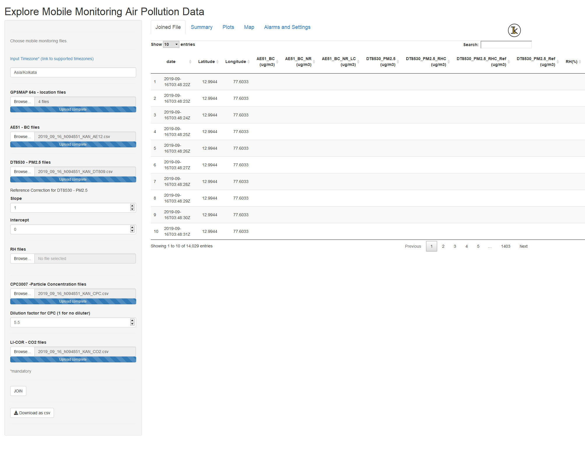
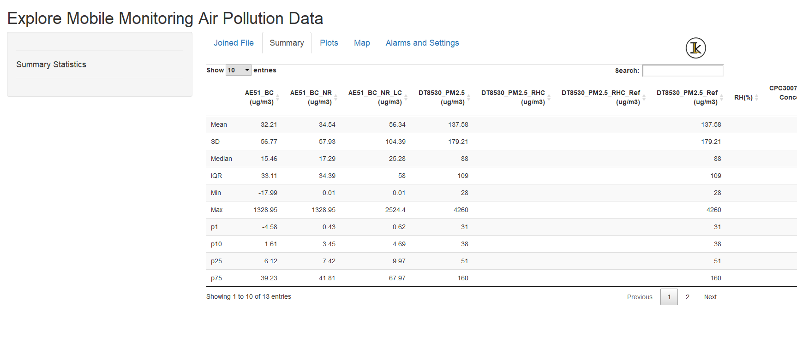
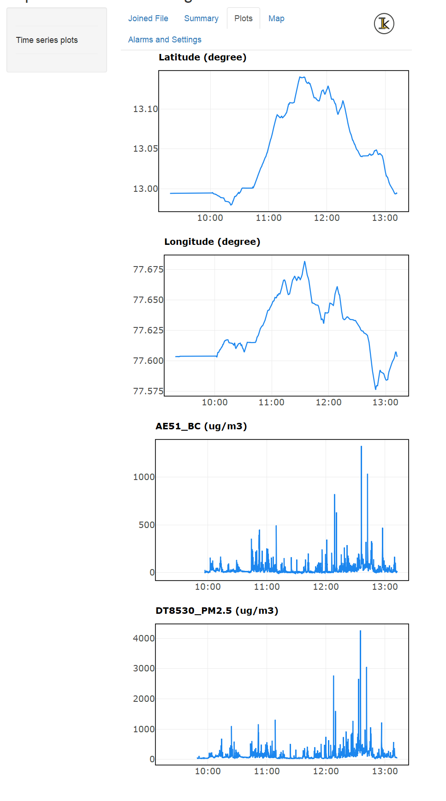
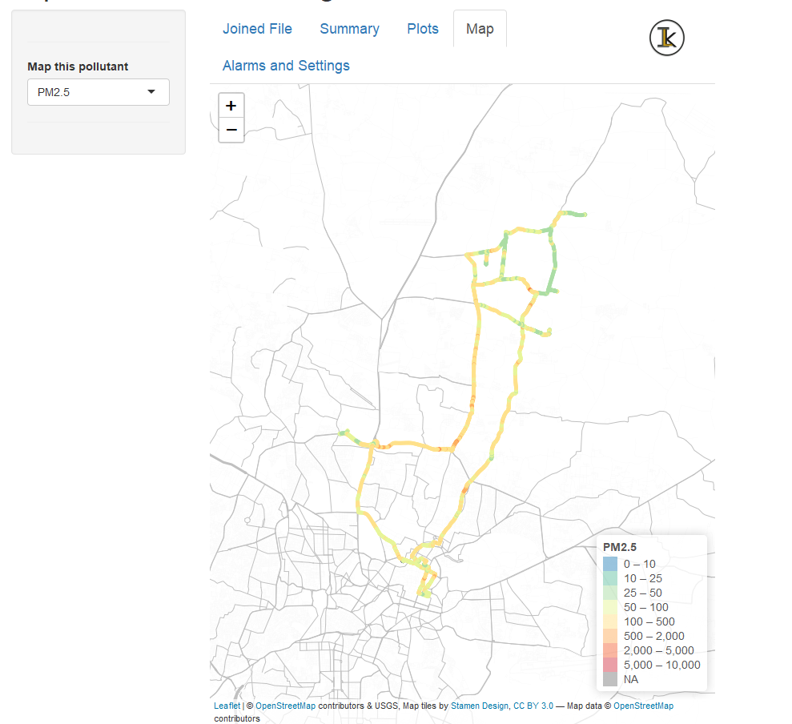
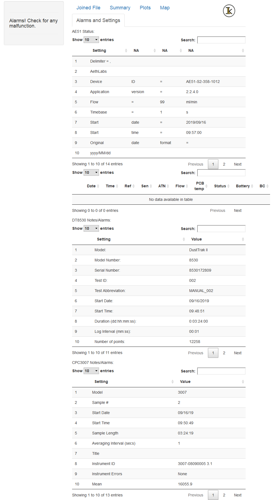

# mmaqshiny v1.0: R-Shiny package to explore air-pollution mobile monitoring data 

<!-- badges: start -->
<!-- badges: end -->

## Summary

Mobile monitoring of air pollution is being gradually adapted by research groups and governments to complement their existing stationary monitoring facilities, to understand the hyper-local nature of the air-pollution levels.

The R-Shiny package `mmaqshiny` is for analysing, visualising and spatial-mapping of high-resolution air-pollution data collected by specific devices installed on a moving platform. 

`1-Hz` data of PM2.5 (mass concentrations of particulate matter with size less than 2.5 microns), Black carbon mass concentrations (BC), ultra-fine particle number concentrations, carbon-di-oxide along with GPS coordinates and relative humidity (RH) data collected by some popular portable instruments (`TSI DustTrak-8530, Aethlabs microAeth-AE51, TSI CPC3007, LICOR Li-830, Garmin GPSMAP 64s, Omega USB RH probe` respectively) can be handled by this package. It incorporates device-specific cleaning and correction algorithms. RH correction is applied to DustTrak PM2.5 following [@Chakrabarti:2004]. Provision is given to input linear regression coefficients for correcting the PM2.5 data (if required). BC data will be cleaned for the vibration generated noise, by adopting the statistical procedure as explained in [@Apte:2011], followed by a loading correction as suggested by [@Ban-Weiss:2009]. For the number concentration data, provision is given for dilution correction factor (if a diluter is used with CPC3007; default value is 1).

The package joins the raw, cleaned and corrected data from the above said instruments and outputs as a downloadable csv file. It accepts multiple files for each parameter. The raw files downloaded from each instrument have to be renamed starting with `yyyy_mm_dd`, for using as inputs into the package, since it matches the first 10 characters of the file name to check for consistency.

The package will require GPS file (.gpx) as a mandatory input along with the timezone of the at which the data is collected (a link to all accepted timezones in R is also included). All other pollutant files can be optional. 

All the raw and processed data will be displayed in the `Joined File` tab, while a basic statistical summary of each parameter is provided in the `Summary` tab. The `Plots` tab displays interactive  time series line plots (using plotly) for select parameters, while the `Map` tab provides a spatial map for the user selected pollutant. `Alarm and Settings` tab displays each instruments’ settings and alarms (if any).


`mmaqshiny` handles high-resolution mobile monitoring air-pollution data, automates several data cleaning and correction algorithms, outputs a combined csv file and generates interactive time series plots and spatial maps on an OpenStreetMap background. The joined fie can then ne used for further analysis.


## Limitations

1) handles single day data at a time
2) only provision for linear correction coefficients of PM2.5
3) instrument specific 
4) file renaming is required


## Installation

`mmaqshiny` can be intsalled from [GITHUB](https://github.com/) with:

``` r
devtools::install_github("meenakshi-kushwaha/mmaqshiny")
```

## Example

- A sample data collected during the mobile monitoring campaign in Bangalore, India appears upon running the app as a preloaded data.

- App warns if there is a mismatch in the file names.

- App can run using the code below- 

``` r
library(mmaqshiny)
mmaqshiny::mmaqshiny_run()
```

## User Guide

1. User needs to add the . 

2. Add .gpx files. 

3. Add .csv files for pollutant data.

4. User can add slope and intercept if a linear correction equation is available for the measured PM2.5. 

5. User can input Dilution factor is diluter is used along with CPC - 3007. 

6. Click join button. 

7. Click download button to download the joined file as a csv file.



8. Summary tab allows user to check the summary statistics for each of the pollutant. 



9. Plots tab displays the time series of parameters collected. 



10. Map tab visualises the selected pollutants spatially.



11. Alarms and Settings displays the concerns and settings of each instrument. 




## Glossary
- `Latitude`:Latitude
- `Longitude`: Longitude
- `AE51_BC`: Raw BC data 
- `AE51_BC_NR`: Noise removed BC 
- `AE51_BC_NR_LC`: Noise removed and loading corrected BC
- `DT8530_PM2.5`: Raw PM2.5
- `DT8530_PM2.5_RHC`: RH corrected PM2.5
- `DT8530_PM2.5_RHC_Ref`: Reference and RH corrected PM2.5
- `DT8530_PM2.5_Ref`: Reference corrected PM2.5
- `CPC3007_Particle Concentration`: Dilution corrected ultra-fine particle number concentration
- `LI-COR 850`: CO2 data


## Community guidelines

Report Issues:

- Questions, feedback, bug reports: please open an issue in the issue tracker of the project here.

Contribution to the software:

- Please open an issue in the issue tracker of the project that describes the changes you would like to make to the software and open a pull request with the changes. The description of the pull request must references the corresponding issue.


## Instrument Description

1. DustTrak 8530

DustTrak 8530 Aerosol Monitor utilises the well-established aerosol light scattering technique to estimate the real-time aerosol mass loadings and works at a flow rate of 3 LPM (liters per minute).  Detailed specifications can be found here - https://tsi.com/products/aerosol-and-dust-monitors/dust-monitors/dusttrak-ii-aerosol-monitor-8530/


2. MicroAeth AE51

MicroAeth AE51 is a highly sensitive, palm-held and battery-operated instrument designed for measuring the optically-absorbing Black Carbon (BC) component of aerosol particles.It measures the rate of change in absorption of transmitted light (880 nm) due to continuous collection of aerosols load on to the filter ticket and has a wide dynamic range of measurement from 0 to 1 mg/m³. More details of AE51 can be found here -  https://aethlabs.com/microaeth/ae51/overview.

3. Condensation Particle Counter 3007 (CPC)

CPC 3007 is an alcohol based handheld instrument by TSI used to measure ultrafine particles. It works on the optical detection principle, and operates at a flow rate of 0.7 LPM.The instrument detects and measures the particles in the size range of 10 nm to > 1 µm. More technical details of the instrument can be found here - https://www.tsi.com/condensation-particle-counter-3007/

4. LI-COR 850

LI-850 is a CO2/H2O gas analyzer which has a measurement range of 0-20,000 ppm and accuracy of 1.5%. For logging the data it requires a laptop with the software called LI-COR. More details can be found at https://www.licor.com/env/products/gas_analysis/LI-830_LI-850/ 

5. RH-USB

Omega RH-USB is an instrument used for measuring RH and temperature. It has an accuracy of ±3% for Relative humidity and  ±1°C (±1.8°F) for temperature. It requires a software to log the data called TRH central. The frequency of data logging can be changed as per need using this software. For more information visit https://www.omega.com/en-us/calibration-equipment/handheld-calibrator/p/RH-USB-Series

6. GPSMAP-64s

GPSMAP-64s (Garmin, USA) works on the ‘trilateration’ mathematical principle of GPS and usually connects to 4 satellites to give the accurate location. More technical details of the instrument can be found at https://www.garmin.co.in/products/outdoor/gpsmap64s-sea/


## Acknowledgements

We wish to thank Prof. Julian Marshall (University of Washington, Seattle), Prof. Joshua Apte (University of California, Berkeley), Dr. Maelle Salmon, Dr. Florencia D'Andrea and R Ladies community for their help and support.

